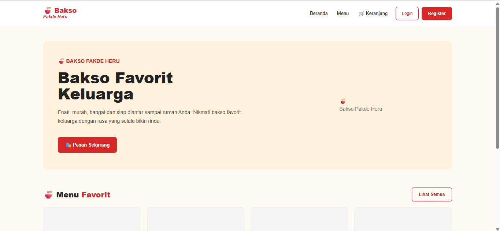
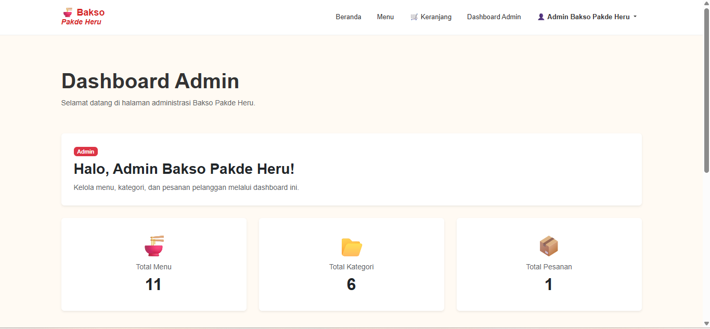
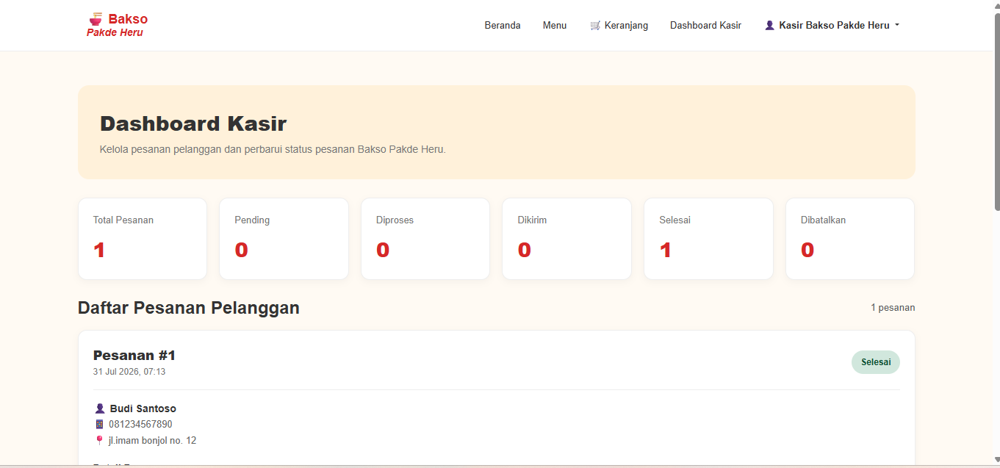
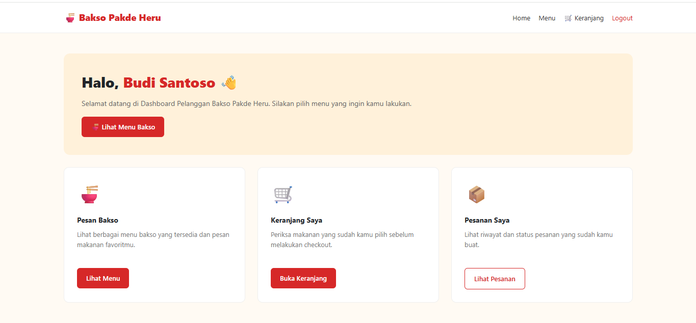
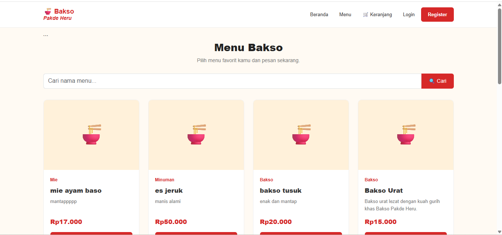
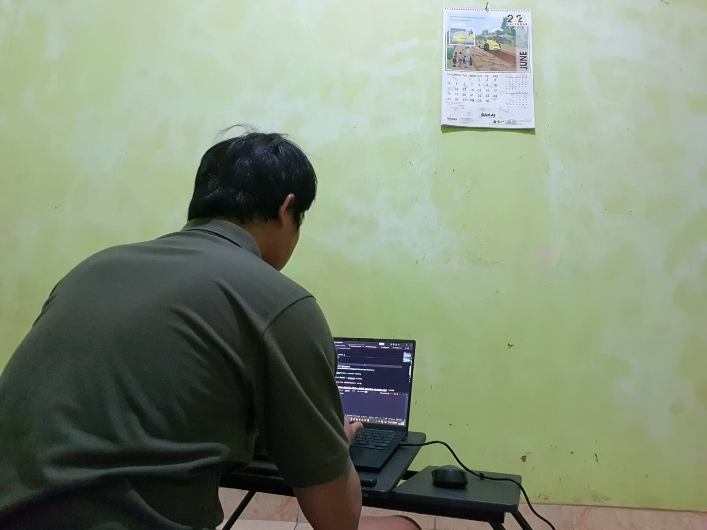
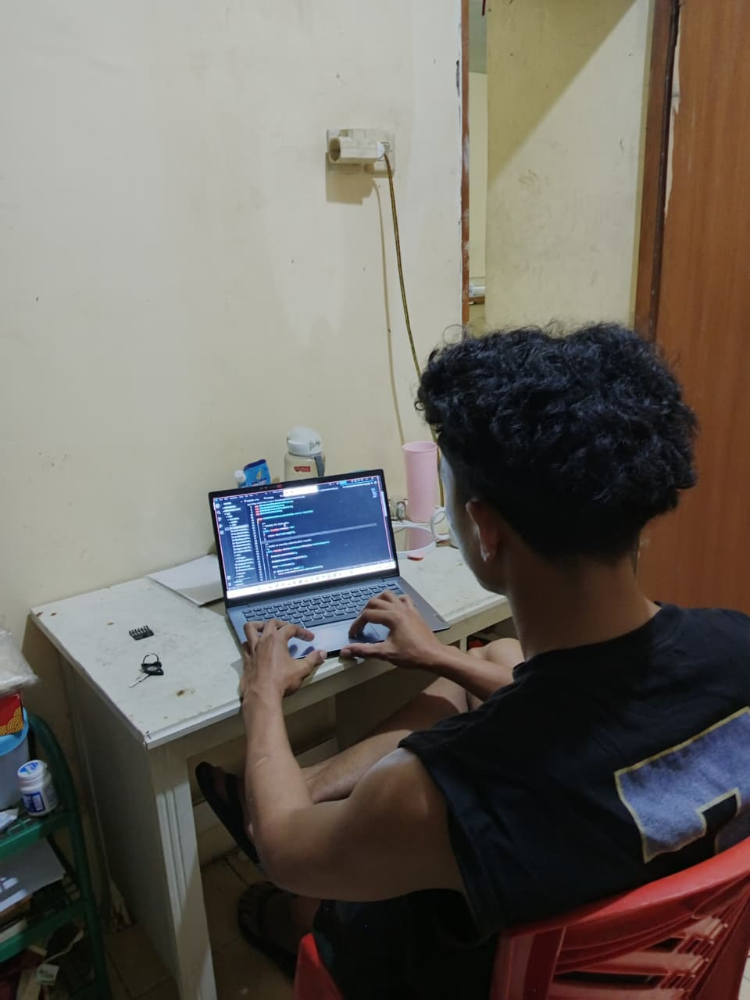

# 🍜 Bakso Pakde Heru

## Sistem Informasi Pemesanan, Kasir, dan Manajemen Menu Berbasis Web

**Bakso Pakde Heru** merupakan aplikasi web berbasis **Laravel** yang dikembangkan sebagai **Proyek Akhir Semester (UAS) Mata Kuliah Pemrograman Web II**.

Aplikasi ini dirancang untuk membantu proses pemesanan makanan secara digital mulai dari pelanggan melakukan pemesanan, kasir mengelola pesanan, hingga admin mengelola menu, kategori, dan pembayaran.

Selain menyediakan fitur CRUD, aplikasi ini juga menerapkan konsep-konsep Laravel seperti **Authentication, Authorization (Middleware), Migration, Seeder, Eloquent Relationship, AJAX (Fetch API), dan Eager Loading**.

---

# 👥 Anggota Kelompok

1. Maria Geni Anita Mare
2. Novriadi Naibahi
3. Theobaldus S. Ngaban

---

# 🎯 Tujuan Aplikasi

Aplikasi ini dibuat untuk:

* Memudahkan pelanggan melakukan pemesanan makanan secara online.
* Mempermudah admin mengelola menu dan kategori.
* Membantu kasir dalam memproses pesanan pelanggan.
* Menerapkan konsep Laravel sesuai standar industri.
* Memenuhi persyaratan Proyek Akhir Semester (UAS) Pemrograman Web II.

---

# 🛠 Teknologi yang Digunakan

* Laravel 12
* PHP 8.x
* SQLite / MySQL
* Bootstrap 5
* JavaScript
* Fetch API (AJAX)
* Laravel Blade
* Eloquent ORM
* Laravel Middleware
* Laravel Migration
* Seeder & Faker
* Vite
* Git
* GitHub

---

# 👤 Hak Akses (Role)

Aplikasi memiliki tiga jenis pengguna.

## 1. Admin

Admin memiliki hak akses untuk:

* Login
* Dashboard Admin
* Mengelola Menu
* Mengelola Kategori
* Mengelola Pesanan
* Mengelola Pembayaran
* Melihat statistik data

---

## 2. Kasir

Kasir memiliki hak akses untuk:

* Login
* Dashboard Kasir
* Melihat daftar pesanan
* Mengubah status pesanan
* Memproses pembayaran pelanggan

---

## 3. Pelanggan

Pelanggan dapat:

* Registrasi akun
* Login dan Logout
* Melihat daftar menu
* Melakukan pencarian menu
* Menambahkan menu ke keranjang
* Mengubah jumlah pesanan
* Menghapus menu dari keranjang
* Checkout
* Memilih metode pembayaran
* Melihat riwayat pesanan

---

# 🔐 Authentication & Authorization

Aplikasi menggunakan sistem autentikasi Laravel.

Fitur yang diterapkan:

* Login
* Register
* Logout
* Session Authentication
* Middleware
* Pembatasan hak akses berdasarkan role (Admin, Kasir, dan Pelanggan)

Setiap halaman penting diproteksi menggunakan **Laravel Middleware**, sehingga pengguna hanya dapat mengakses halaman sesuai dengan role yang dimiliki.

---

# 🗄 Database

Database dibangun menggunakan Laravel Migration.

Relasi antar tabel menggunakan **Foreign Key** sehingga menjaga konsistensi data.

Database utama meliputi:

* users
* categories
* menus
* orders
* order_items
* payments

Aplikasi juga dilengkapi Seeder dan Faker untuk menghasilkan data contoh sehingga memudahkan proses pengujian.

---

# ⚡ Implementasi AJAX / Fetch API

Aplikasi menerapkan AJAX menggunakan **Fetch API** pada beberapa fitur penting.

### 1. Pencarian Menu

* Pencarian dilakukan secara otomatis.
* Tidak memerlukan reload halaman.
* Data diambil melalui request AJAX.

### 2. Tambah ke Keranjang

* Menu ditambahkan menggunakan AJAX.
* Jumlah item keranjang diperbarui secara otomatis.
* Halaman tidak melakukan refresh setelah proses berhasil.

Implementasi ini meningkatkan pengalaman pengguna (User Experience) dan memenuhi persyaratan integrasi AJAX pada proyek UAS.

---

# 🚀 Optimasi Performa

Untuk meningkatkan performa aplikasi, diterapkan:

* Eager Loading pada relasi Eloquent untuk menghindari Query N+1.
* Struktur relasi database menggunakan Eloquent Relationship.
* Kode dipisahkan ke Controller sehingga logika bisnis tidak berada pada Route maupun View.

---

# ⚙️ Cara Instalasi

Clone repository:

```bash
git clone https://github.com/Geni2768/bakso-pakde-heru.git
```

Masuk ke folder project:

```bash
cd bakso-pakde-heru
```

Install dependency PHP:

```bash
composer install
```

Install dependency JavaScript:

```bash
npm install
```

Salin file environment:

```bash
cp .env.example .env
```

Generate application key:

```bash
php artisan key:generate
```

Konfigurasi database pada file `.env`.

Jalankan migration dan seeder:

```bash
php artisan migrate --seed
```

Jalankan Vite:

```bash
npm run dev
```

Jalankan server Laravel:

```bash
php artisan serve
```

Buka aplikasi melalui browser:

```
http://127.0.0.1:8080
```

---

# 🔑 Akun Demo

## Admin

Email:

```
admin@gmail.com
```

Password:

```
admin123
```

---

## Pelanggan

Email:

```
budisantoso@gmail.com
```

Password:
```
password123
```
## Pelanggan

Silakan melakukan registrasi melalui halaman **Register** atau menggunakan akun pelanggan yang tersedia pada database hasil Seeder.

---

# 📖 Panduan Penggunaan

## Admin

1. Login sebagai Admin.
2. Masuk ke Dashboard Admin.
3. Kelola kategori.
4. Kelola menu.
5. Kelola pesanan.
6. Kelola pembayaran.

---

## Kasir

1. Login sebagai Kasir.
2. Buka Dashboard Kasir.
3. Lihat daftar pesanan.
4. Perbarui status pesanan.
5. Konfirmasi pembayaran.

---

## Pelanggan

1. Registrasi akun.
2. Login.
3. Lihat daftar menu.
4. Cari menu menggunakan fitur pencarian.
5. Tambahkan menu ke keranjang.
6. Checkout pesanan.
7. Pilih metode pembayaran.
8. Lihat riwayat pesanan.

---

# 📂 Struktur Folder

```
app/
bootstrap/
config/
database/
public/
resources/
routes/
storage/
tests/
```

---

# 📌 Fitur Utama

✅ Multi Role Authentication

✅ Middleware Authorization

✅ CRUD Menu

✅ CRUD Kategori

✅ Keranjang Belanja

✅ Checkout

✅ Riwayat Pesanan

✅ Manajemen Pembayaran

✅ AJAX Pencarian Menu

✅ AJAX Tambah ke Keranjang

✅ Migration

✅ Seeder & Faker

✅ Eloquent Relationship

## 👨‍💼 Dashboard Admin

```text
                    ┌─────────────────────┐
                    │   Dashboard Admin   │
                    └──────────┬──────────┘
                               │
      ┌──────────────┬─────────┼──────────┬──────────────┐
      ▼              ▼         ▼          ▼              ▼
┌───────────┐ ┌──────────┐ ┌──────────┐ ┌────────────┐ ┌──────────┐
│ Data Menu │ │Kategori  │ │ Pesanan │ │Pembayaran │ │ Laporan │
└─────┬─────┘ └────┬─────┘ └────┬─────┘ └─────┬──────┘ └────┬─────┘
      ▼            ▼            ▼             ▼              ▼
 Tambah/Edit   Tambah/Edit  Update Status  Verifikasi     Statistik
   Hapus         Hapus        Pesanan      Pembayaran     Penjualan

## 💳 Dashboard Kasir

```text
                 ┌────────────────────┐
                 │ Dashboard Kasir    │
                 └─────────┬──────────┘
                           │
          ┌────────────────┼────────────────┐
          ▼                ▼                ▼
   ┌─────────────┐  ┌──────────────┐  ┌──────────────┐
   │ Daftar      │  │ Pembayaran   │  │ Riwayat      │
   │ Pesanan     │  │ Pesanan      │  │ Transaksi    │
   └─────┬───────┘  └──────┬───────┘  └──────┬───────┘
         ▼                 ▼                 ▼
  Konfirmasi Order   Verifikasi Bayar   Laporan Harian
```
## 👤 Dashboard Pelanggan

```text
                 ┌────────────────────┐
                 │ Dashboard Customer │
                 └─────────┬──────────┘
                           │
      ┌──────────────┬─────┼────────────┬─────────────┐
      ▼              ▼     ▼            ▼             ▼
┌──────────┐ ┌──────────┐ ┌─────────┐ ┌──────────┐ ┌────────────┐
│ Lihat    │ │ Detail   │ │ Cart    │ │ Checkout │ │ Riwayat    │
│ Menu     │ │ Menu     │ │         │ │          │ │ Pesanan    │
└────┬─────┘ └────┬─────┘ └────┬────┘ └────┬─────┘ └─────┬──────┘
     ▼            ▼            ▼           ▼             ▼
 Tambah Cart   Lihat Detail  Edit Qty   Pembayaran   Status Order
```

# 🖼️ Tampilan Aplikasi

Berikut merupakan beberapa tampilan utama dari aplikasi **Bakso Pakde Heru**.

---

## 🏠 Landing Page

<p align="center">
    
</p>

Landing Page merupakan halaman utama yang menampilkan informasi restoran, menu favorit, serta tombol untuk login, registrasi, dan melakukan pemesanan.

---

## 👨‍💼 Dashboard Admin

<p align="center">
    
</p>

Dashboard Admin digunakan untuk memantau statistik aplikasi serta mengelola seluruh data yang ada pada sistem, seperti Menu, Kategori, Pesanan, Pembayaran, dan Data Pengguna.

---

## 💳 Dashboard Kasir

<p align="center">
    
</p>

Dashboard Kasir digunakan untuk melihat daftar pesanan pelanggan, memproses pembayaran, serta memperbarui status pesanan.

---

## 👤 Dashboard Pelanggan

<p align="center">
    
</p>

Dashboard Pelanggan digunakan untuk melihat menu makanan, melakukan pemesanan, mengelola keranjang belanja, checkout, dan melihat riwayat transaksi.

---

## 🍜 Kelola Menu

<p align="center">
    
</p>

Halaman Menu digunakan oleh Admin untuk menambah, mengubah, menghapus, dan mengelola seluruh data menu yang tersedia.

# 👥 Dokumentasi Kelompok

| Maria Geni Anita Mare | Novriadi Naibaho | Theobaldus S. Ngaban |
|:----------------------:|:----------------:|:--------------------:|
|  |  |  |

# 📄 Lisensi

Project ini dibuat untuk keperluan akademik sebagai **Proyek Akhir Semester (UAS) Mata Kuliah Pemrograman Web II**.

Hak cipta © 2026 Maria Geni Anita Mare, Novriadi Naibahi, dan Theobaldus S. Ngaban.

Seluruh hak cipta dilindungi.

